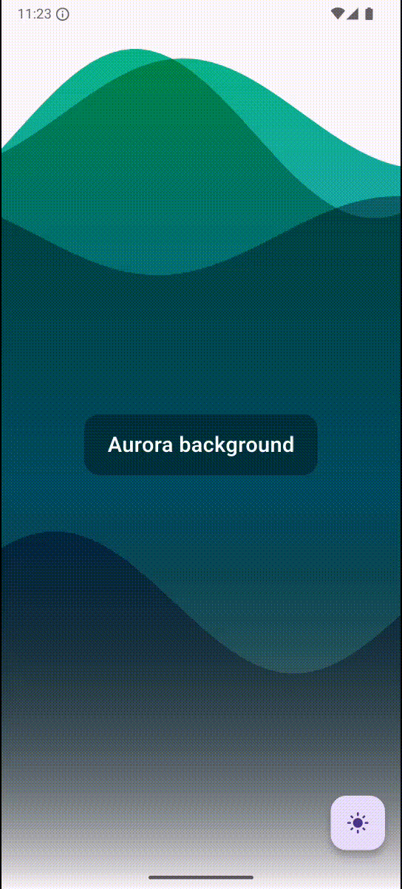

<!--
This README describes the package. If you publish this package to pub.dev,
this README's contents appear on the landing page for your package.

For information about how to write a good package README, see the guide for
[writing package pages](https://dart.dev/tools/pub/writing-package-pages).

For general information about developing packages, see the Dart guide for
[creating packages](https://dart.dev/guides/libraries/create-packages)
and the Flutter guide for
[developing packages and plugins](https://flutter.dev/to/develop-packages).
-->

# Fuzzy Backgrounds

Fuzzy backgrounds allows you to use fuzzy, dynamic (fluid) backgrounds in your Flutter applications.

## Features

You can choose from several types of backgrounds.


 





## Installing

To get started, install `fuzzy_backgrounds`:

```shell
flutter pub add fuzzy_backgrounds
```

## Usage

You can use different types of backgrounds in your code by including the widgets
and wrapping your content as their `child` property:

```dart
FuzzyCirclesBackground(
    child: const Text(
      'Circles Background',
      style: TextStyle(
        color: Colors.white,
        fontSize: 22,
        fontWeight: FontWeight.w600,
      ),
    ),
),
```

## Customization

Different backgrounds offer various customization options including animation speed, colors, 
particle numbers and more.

For more information refer to the [documentation](doc/api/index.html).
